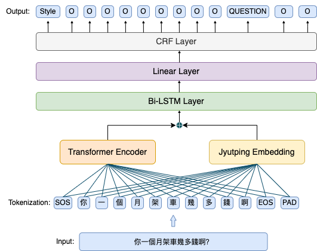

# PunCantonese: A Benchmark Corpus for Low-Resource Cantonese Punctuation Restoration from Speech Transcripts

This repository contains the data and source code of the  paper accepted at the InterSpeech2023, *PunCantonese: A Benchmark Corpus for Low-Resource Cantonese* *Punctuation Restoration from Speech Transcripts*.


## Data

The dataset would be available upon request to this email address: yunxiang.li@link.cuhk.edu.hk


## Model
We propose a Transformer-based neural network model to evaluate the  **PunCantonese** corpus. 

The model exploits pre-trained language models to obtain a good network initialization, a multi-task learning objective to prevent the network from paying too much attention to the largest subset of written-style sentences and a novel Jyutping embedding layer to represent a Cantonese character with its Jyutping sequence which potentially enables the model to incorporate phonetic features that are not explicitly available in Cantonese characters. Then we have one Bi-LSTM and one linear layer for classification.




## Training
To train our model with default settings and with both multitask learning and jyutping embedding on, run the following command
```
python src/train_jyupin_multi.py --cuda=True --pretrained-model=bert-base-multilingual-uncased --freeze-bert=False --lstm-dim=-1 --seed=0 --lr=2e-5 --epoch=15 --use-crf=False --data-path=data --save-path=out --batch-size=32 --sequence-length=128 --loss=focal --multitask=True --jyutping=True
```

## Acknowledgements

This project is based on modifications made to the original code from [Punctuation Restoration using Transformer Models](https://github.com/xashru/punctuation-restoration). Special thanks to the authors from this work for providing the excellent code base. 

## License

This repository is under the [Apache License 2.0](https://github.com/apache/.github/blob/main/LICENSE). 
